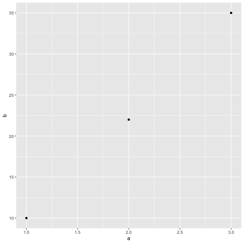

## How do I say hello?

We begin with a traditional greeting:


```r
print("Hello, world!")
#> [1] "Hello, world!"
```

And then create a plot:


```r
data <- tribble(~a, ~b, 1, 10, 2, 22, 3, 35)
data %>% ggplot() + geom_point(mapping = aes(x = a, y = b))
```



And then include a figure:


```r
knitr::include_graphics("figures/basics/elder-sign.png")
```



